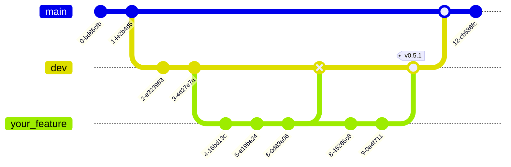

# Contributing

When contributing always follow the conventional commits

## Branching


## Commits

Commits messages should always be descriptive. Meaning technical descriptions without personal believes or feelings. Commits should always include any of these prefixes:

| Prefix              | Use case                                                       					   				|
| ------------------- | ------------------------------------------------------------------------------------------------|
| `build:`            | The commit includes changes that affect the build syste, or external dependencies. 				|
| `fix:`              | The commit includes fixes for existing bugs.                   					   				|
| `feat:`             | The commit includes new features to the project.               					   				|
| `docs:`             | The commit includes documentation update.                      					   				|
| `ci`				  | The commit includes changes to the Continuous Integration (CI) configuration files and scripts. |
| `chore`		      | The commit includes a code change that neither fixes a bug nor adds a feature.					|
| `test`			  | The commit includes adding missing tests or correcting existing tests.
| `style`			  | The commit includes changes that do not affect the meaning of code.								|

Commits should only contain changes related to the prefix used, for example: Never commit feat files with docs files.

Commit examples:

```
feat: allow provided config object to extend other configs
```

```
docs: correct spelling of CHANGELOG
```

```
feat(lang): add Polish language
```

A recommendation is to search for the already existing commits in a repository.

## Issues

For issues names follow the same instructions of the [Commits](#Commits) section.

Describing issues should follow the issue template for each repository

## Pull Requests

For PR names follow the same instructions of the [Commits](#Commits) section.

- PR should always be created with existing Opened issues.
- PR description should point all the changes made by the devs.

PR will be always merged using `squash`.

- Make sure the description of the `Merge` contains all the commits made.